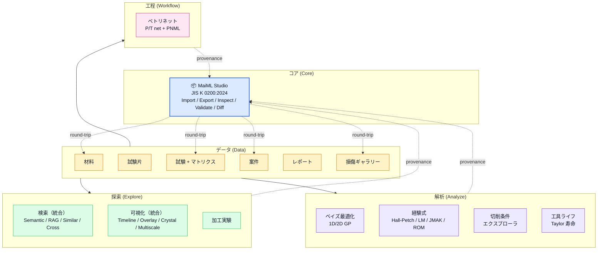

# Matlens アーキテクチャ俯瞰

> MaiML を中核に据えた Matlens の概念マップ。データの入出力・探索・解析・工程の 4 衛星が MaiML Studio を中心に連携します。

## 1 枚絵: MaiML 中核モデル



## 構成原則

### 1. MaiML がアプリの存在理由
- **MaiML (JIS K 0200:2024)** はラボ計測器・LIMS・OEM との相互運用フォーマット
- Materials / Tests / Projects / Damage はすべて MaiML として round-trip 可能
- Provenance（出所）と Uncertainty（不確かさ）は MaiML 必須項目として全データに紐付く

### 2. レイヤード分離（ADR-0001）
```
src/
├── domain/        ドメイン型 + Zod スキーマ + 定数（外部依存なし）
├── infra/         api / mappers / repositories（純 TS）
├── mocks/         seeds + generators + MSW handler
├── app/providers/ RepositoryProvider + QueryProvider
└── features/      機能単位モジュール
    ├── maiml/     コア要素
    ├── projects/  案件
    ├── tests/     試験 + マトリクス
    ├── damage/    損傷
    ├── cutting/   切削プロセス
    ├── tools/     工具ライフ
    ├── dashboard/ KPI ダッシュボード
    ├── explore/   検索 / 可視化 統合ハブ
    └── search/    旧横断検索（PoC）
```

### 3. Framework-Agnostic 境界
将来 Vue/Nuxt 等への移植可能性を保つため、以下は **React 非依存**:
- `domain/types/`, `domain/schemas/`, `domain/constants/`
- `infra/repositories/interfaces/` および `mock/` 実装
- `services/maiml.ts`, `services/maimlProject.ts`（純 TS シリアライザ）
- `services/bayesianOpt.ts`, `services/empiricalFormulas.ts`
- `features/cutting/utils/`（FFT / Taylor / Stability Lobe / Kc 切削抵抗）
- `features/damage/similarity.ts`
- `features/dashboard/utils/opsMetrics.ts`
- `design-tokens/`（CSS variables + Tailwind tokens）

詳細は [リプレイス計画 #107](https://github.com/BoxPistols/Matlens/issues/107) と [Phase 0 抽出 #108](https://github.com/BoxPistols/Matlens/issues/108) を参照。

## 関連 ADR
- ADR-0001: レイヤードアーキテクチャ
- ADR-0004: MaiML を主要出力フォーマットとする
- ADR-0006: ペトリネット可視化（純 SVG 自作）
- ADR-0007: 連動更新ルール（announcements / README / PAGE_GUIDES）
- ADR-0015: 機密化と命名ポリシー
- ADR-0016: MaiML をコア要素として位置付ける（本 IA リファクタの根拠）
